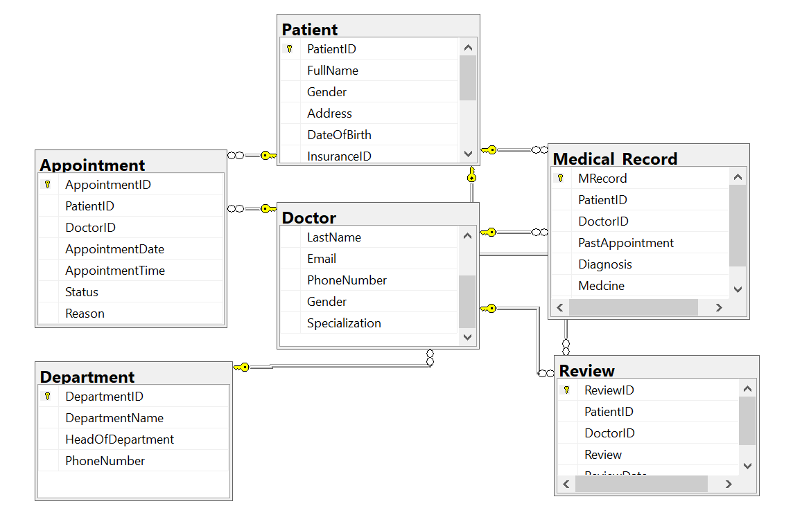

# Database-Design-Report-for-Hospital-System

## Executive Summary
This report outlines the database system design developed for a hospital seeking to manage patient registration, appointments, medical history, doctors, departments, and reviews. The database was designed using SQL Server and developed based on consultation with hospital stakeholders and their functional requirements. The system enforces data integrity, supports patient interactions through a portal, ensures accurate appointment tracking, and allows healthcare staff to manage medical records effectively.

This report outlines the design decisions, processes, and steps involved in creating a database system tailored to the hospital's requirements, including the creation of necessary tables and constraints in SQL Server.

### Understanding the Client Requirements

The hospital's primary requirements are centered around storing and managing data related to patients, doctors, appointments, medical records, departments, and patient reviews. Key requirements gathered during consultation include:

• <ins>*Patient Registration:</ins>* Store personal, contact, and insurance information. Optional details include email and phone number. Patients create a secure login for accessing a portal.

• <ins>*Appointment Management:</ins>* Patients should be able to book appointments. System checks doctor's availability and logs appointment details including status (pending, completed, or cancelled).

• <ins>*Medical Records:</ins>* Doctors must be able to access and update the patient’s past diagnoses, medicines, allergies, and appointment history.

• <ins>*Reviews:</ins>* Patients can review doctors after completed appointments.

• <ins>*Retention Policy:</ins>* If a patient leaves the hospital, their information remains stored with a date of exit noted (to be implemented in future iteration).

## Database Design Strategy

A 3NF normalized relational database design was adopted, with a focus on eliminating data redundancy, ensuring data integrity through constraints, and enabling scalability for future features.

-- CREATE THE DATABASE

          *CREATE DATABASE HospitalDB;*

-- SWITCH TO THE NEW DATABASE

          *USE HospitalDB;*

This block of SQL code creates a new database named HospitalDB and selects it as the current working context. This allows the following table definitions to be applied to the correct database.

# Table Designs and Justifications
 
### Patient Table

       CREATE TABLE Patient(
           PatientID INT PRIMARY KEY IDENTITY(1,1),
           FullName VARCHAR(50),
           Gender CHAR(1),
           Address TEXT,
           DateOfBirth DATE NOT NULL,
           InsuranceID VARCHAR(50) NOT NULL,
           EmailAddress VARCHAR(50),
           PhoneNumber VARCHAR(50),
           UserName VARCHAR(50) NOT NULL,
           Password CHAR(8) CHECK(LEN(Password) >=8) NOT NULL
           );

PatientID is a unique identifier, auto-generated.

Gender uses CHAR(1) for storage efficiency.

Password is restricted to a minimum of 8 characters for basic security.

Email and Phone are optional, reflecting client flexibility.

**Department Table**

      *CREATE TABLE Department*(
           DepartmentID INT PRIMARY KEY IDENTITY(1,1),
           DepartmentName VARCHAR(50) NOT NULL,
           HeadOfDepartment VARCHAR(50) NOT NULL,
           PhoneNumber VARCHAR(20) NOT NULL
           );

DepartmentID is auto-generated to ensure uniqueness.

HeadOfDepartment is included to assign responsibility for each department.

**Doctor Table**

      *CREATE TABLE Doctor*(
           DoctorID INT PRIMARY KEY IDENTITY(1,1),
           DepartmentID INT NOT NULL FOREIGN KEY REFERENCES Department(DepartmentID),
           FirstName VARCHAR(50) NOT NULL,
           LastName VARCHAR(50) NOT NULL,
           Email VARCHAR(50),
           PhoneNumber VARCHAR(20),
           Gender CHAR(1),
           Specialization VARCHAR(50)
           );

Doctors are linked to departments via DepartmentID to track which department each doctor belongs to.

**Appointment Table**

      *CREATE TABLE Appointment*(
           AppointmentID INT PRIMARY KEY IDENTITY(1,1),
           PatientID INT NOT NULL FOREIGN KEY REFERENCES Patient(PatientID),
           DoctorID INT NOT NULL FOREIGN KEY REFERENCES Doctor(DoctorID),
           AppointmentDate DATE NOT NULL,
           AppointmentTime TIME NOT NULL,
           Status VARCHAR(50) CHECK (Status IN ('pending', 'cancelled', 'completed')),
           Reason TEXT NOT NULL
           );

AppointmentDate and AppointmentTime ensure that appointments are scheduled correctly.

The Status column tracks whether an appointment is pending, cancelled, or completed.

The Reason column records the reason for the appointment, which helps doctors in their diagnosis.

**Medical Record Table**

     *CREATE TABLE Medical_Record*(
          MRecord INT PRIMARY KEY IDENTITY(1,1),
          PatientID INT NOT NULL FOREIGN KEY REFERENCES Patient(PatientID),
          DoctorID INT NOT NULL FOREIGN KEY REFERENCES Doctor(DoctorID),
          PastAppointment TEXT,
          Diagnosis VARCHAR(50) NOT NULL,
          Medicine VARCHAR(50) NOT NULL,
          Allergies VARCHAR(50)
          );

MRecord ensures each record is unique.

The inclusion of PastAppointment helps doctors to track the patient's medical journey.

**Review Table**

       *CREATE TABLE Review*(
            ReviewID INT PRIMARY KEY IDENTITY(1,1),
            PatientID INT NOT NULL FOREIGN KEY REFERENCES Patient(PatientID),
            DoctorID INT NOT NULL FOREIGN KEY REFERENCES Doctor(DoctorID),
            Review TEXT NOT NULL, 
            ReviewDate DATE NOT NULL
            );
            
Captures qualitative feedback from patients.

Helps improve transparency and accountability.

**Appointment Date Validation:**
To ensure that appointments are not scheduled in the past, the following constraint is added:

       ADD CONSTRAINT chk_AppointmentDate CHECK (AppointmentDate >= GETDATE());

### Conclusion
The hospital database design is robust, secure, and flexible to meet current and future needs. Each design choice—from table structure to constraints—was guided by the client’s requirements and best practices in relational database design. The system supports patient engagement, efficient doctor workflow, and scalable operations.

This foundational work sets the stage for deployment and future integration with hospital web and mobile systems.

**Prepared by:** **<ins>Victory E. Idewele</ins**

**Database Developer Consultant**

